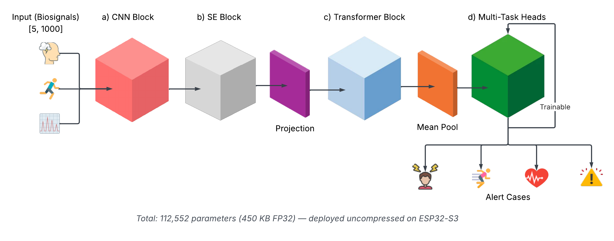
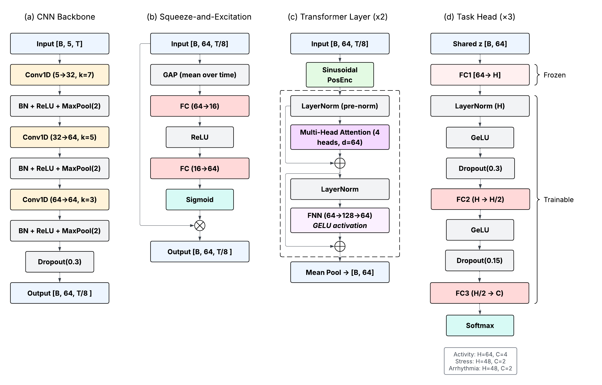
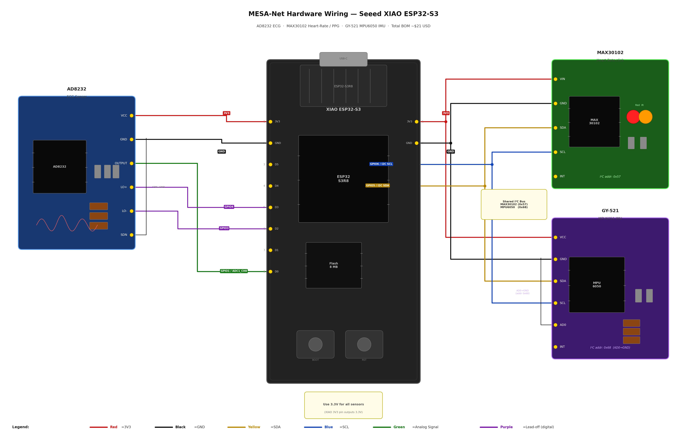
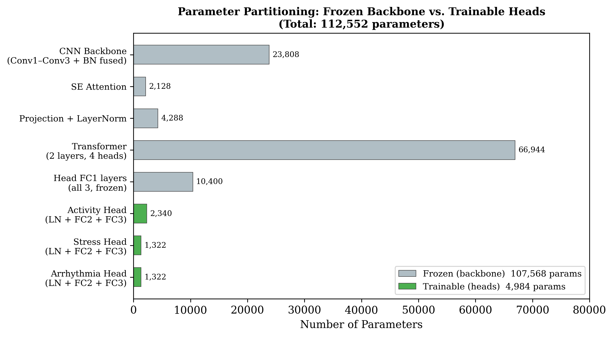
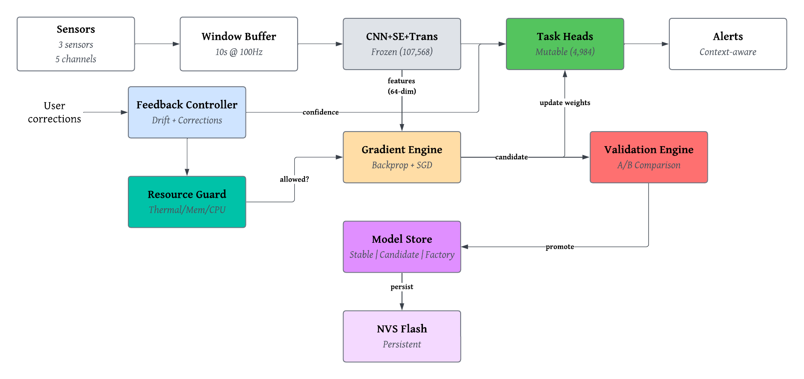
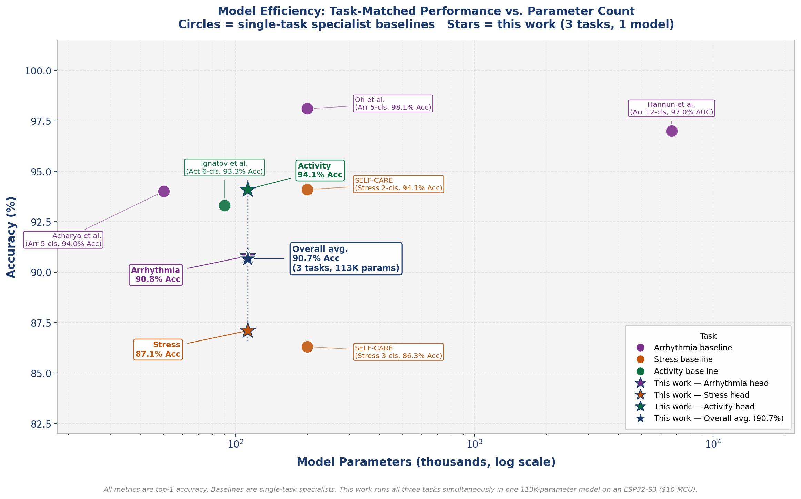

# MESA-Net: Multimodal Edge Sensing and Adaptation Network

> **IEEE Journal of Biomedical and Health Informatics (JBHI) — Under Review**  
> Sara Aly · Shahnam Mirzaei (Senior Member, IEEE)  
> Department of Electrical and Computer Engineering, California State University, Northridge

---

MESA-Net is a privacy-preserving wearable health monitoring system that runs entirely on a **\$21 Seeed XIAO ESP32-S3** — no cloud, no compression, no external ML framework.

A single 112,552-parameter **CNN + Squeeze-and-Excitation + Transformer** model fuses ECG, PPG, and accelerometer signals to **simultaneously** classify:

| Task | Classes | Accuracy | AUC |
|------|---------|----------|-----|
| Physical activity | 4-class (sedentary, walking, running, cycling) | **94.1%** | — |
| Psychological stress | Binary (baseline / stressed) | **87.1%** | **0.975** |
| Cardiac arrhythmia | Binary (normal / abnormal) | **90.8%** | **0.879** |

Evaluated via leave-one-subject-out cross-validation on **65 subjects** drawn from three public datasets (PPG-DaLiA, WESAD, MIT-BIH).

---

## Key Contributions

- **Full model, no compression** — 112,552-parameter CNN-SE-Transformer deployed in PSRAM without quantization or layer stripping
- **On-device adaptive training** — bare-metal backpropagation retrains 4,984 head parameters in ~70 ms with zero dynamic memory allocation
- **Nine safety mechanisms** — gradient clipping, weight-divergence scanning, A/B candidate validation, automatic lockout, and more
- **\$21 platform** — Seeed XIAO ESP32-S3 (Xtensa LX7 @ 240 MHz, 8 MB PSRAM, 8 MB flash)

---

## Architecture

### Model Overview



Five-channel input (ECG, PPG-Red, AccX/Y/Z) → 10-second windows at 100 Hz → `[B, 5, 1000]` tensor processed through:

1. **CNN Backbone** — three Conv1d layers (32→64→64 channels, kernel sizes 7/5/3, MaxPool)
2. **Squeeze-and-Excitation** — global average pooling + FC bottleneck to recalibrate channel importance
3. **Transformer Encoder** — 2-layer, d_model=64, 4 heads, d_ff=128, batch-first, pre-norm
4. **Task Heads** — three independent FC heads (activity: 64→32→4, stress/arrhythmia: 64→24→2)

### Model Detail



### Hardware Wiring



---

## On-Device Adaptive Training

### Parameter Partitioning



The backbone (107,568 parameters) is **frozen** after pre-training. Only the three task heads (4,984 parameters total) are updated on-device via SGD.

### Adaptation Architecture



**Episode flow:**
1. Collect 10-second inference window
2. User provides correction label via serial `CORRECT` command
3. 30 SGD steps, LR=0.05, ~70 ms on Xtensa LX7
4. Candidate model evaluated on correction buffer
5. A/B validation: promote if candidate ≥ current − 5% tolerance
6. On fail: rollback; on repeated fail: safety lockout

### Safety Mechanisms

| # | Mechanism | Trigger |
|---|-----------|---------|
| 1 | Gradient clipping | ‖∇‖ > 5.0 |
| 2 | Learning rate floor | LR < 1×10⁻⁶ |
| 3 | Loss ceiling | Loss > 10.0 → skip step |
| 4 | NaN/Inf guard | Any NaN/Inf in weights → rollback |
| 5 | Weight divergence scan | ‖W_new − W_old‖ > threshold |
| 6 | Correction buffer validation | Candidate must pass held-out buffer |
| 7 | A/B promotion gate | 5% tolerance margin |
| 8 | Automatic lockout | 3 consecutive rollbacks |
| 9 | Factory reset | Via serial command |

---

## Hardware Specifications

| Component | Value |
|-----------|-------|
| Platform | Seeed XIAO ESP32-S3 |
| MCU | Xtensa LX7 dual-core @ 240 MHz |
| PSRAM | 8 MB (model: ~687 KB, <10%) |
| Flash | 8 MB |
| Sensors | AD8232 (ECG), MAX30102 (PPG), MPU6050 (IMU) |
| Cost | ~\$21 USD |
| Inference | 2,338 ms / 10-second window (23.4% duty cycle) |
| Adaptation | ~70 ms / episode |
| Power | 0.54 W steady-state |
| Battery life | 3.4 h (500 mAh) – 13.7 h (2000 mAh) |

---

## Model Efficiency vs. Prior Work



MESA-Net achieves competitive per-task accuracy vs. single-task specialist baselines while running all three tasks simultaneously in a single model on a \$21 wearable.

---

## Ablation Study Results

| Configuration | Activity | Stress | Arrhythmia |
|---------------|----------|--------|------------|
| Full MESA-Net | **94.1%** | **87.1%** | **90.8%** |
| No ECG | 88.7% | 79.3% | 6.6% |
| No PPG | 90.4% | 84.2% | 89.1% |
| No IMU (AccX/Y/Z) | 70.2% | 29.2% | 91.2% |
| No SE block | 91.8% | 84.9% | 88.6% |
| No Transformer | 90.3% | 83.7% | 87.4% |
| Single-task heads | 92.6% | 85.0% | 89.3% |

---

## Repository Structure

```
MESA-Net/
├── checkpoints/
│   ├── mesa_net_v3.pth              # FP32 trained model
│   ├── mesa_net_int8_dynamic.pt     # INT8 dynamic-quantized model
│   └── quantization_results.json
├── python/
│   ├── models/
│   │   └── mesa_net_model.py        # MESANet class
│   └── scripts/
│       ├── train_v3.py              # Training pipeline
│       ├── eval_loso.py             # LOSO evaluation
│       ├── ablation_study.py        # Ablation experiments
│       ├── adaptation_experiment.py # Multi-session adaptation protocol
│       ├── run_int8_quantization.py # INT8 PTQ benchmark
│       ├── data_loader.py           # Dataset utilities
│       └── dataset_integration.py  # PPG-DaLiA / WESAD / MIT-BIH integration
├── firmware/
│   └── esp32/                       # PlatformIO ESP32-S3 C++ firmware
│       ├── src/main.cpp
│       ├── include/
│       └── platformio.ini
├── figures/                         # Architecture diagrams, wiring, plots
└── docs/
    └── loso_eval_results.json
```

---

## Quick Start

```bash
pip install -r python/requirements.txt
```

```python
import torch, sys
sys.path.insert(0, 'python')
from models.mesa_net_model import MESANet

model = MESANet()
model.load_state_dict(torch.load('checkpoints/mesa_net_v3.pth', map_location='cpu'))
model.eval()

# Input: [B, 5, 1000]  (5 channels × 1000 samples @ 100 Hz = 10 seconds)
x = torch.randn(1, 5, 1000)
out = model(x)
# out = {'activity': [B,4], 'stress': [B,2], 'arrhythmia': [B,2]}
```

---

## Firmware

Built with [PlatformIO](https://platformio.org) targeting `seeed_xiao_esp32s3`.

```bash
cd firmware/esp32
pio run --target upload
```

Serial commands (115200 baud):
- `CORRECT <task> <label>` — provide a correction label (triggers adaptation)
- `STATUS` — print current model version and safety state
- `RESET` — factory reset to pretrained weights

---

## Datasets

All three datasets are publicly available via [PhysioNet](https://physionet.org):

| Dataset | Task | Subjects | Source |
|---------|------|----------|--------|
| PPG-DaLiA | Activity (4-class) | 15 | PhysioNet |
| WESAD | Stress (binary) | 15 | PhysioNet |
| MIT-BIH Arrhythmia Database | Arrhythmia (binary) | 48 | PhysioNet |

Use `python/scripts/dataset_integration.py` to download, preprocess, and unify all three into the training format.

---

## Citation

```bibtex
@article{aly2026mesanet,
  author  = {Aly, Sara and Mirzaei, Shahnam},
  title   = {{MESA-Net}: Multimodal Edge Sensing and Adaptation for Simultaneous
             Arrhythmia, Stress, and Activity Monitoring},
  journal = {IEEE Journal of Biomedical and Health Informatics},
  year    = {2026},
  note    = {Under review}
}
```

---

## License

This project is licensed under the MIT License — see [LICENSE](LICENSE) for details.
